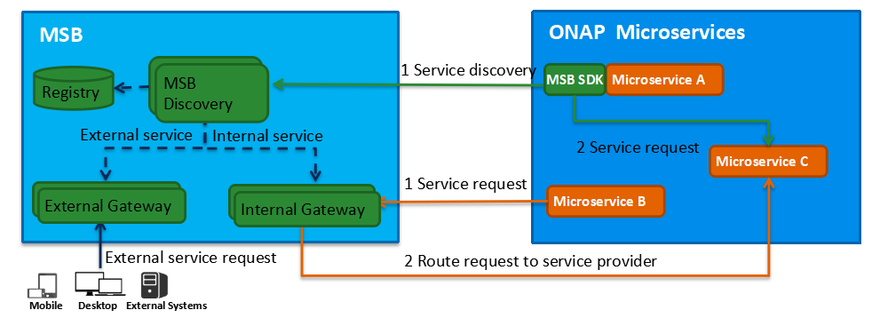

.. This work is licensed under a Creative Commons Attribution 4.0 International License.
.. _architecture:

Architecture
------------
Microservices Bus(MSB) provides a reliable, resilient and scalable communication and governance infrastructure to support ONAP Microservice Architecture including service registration/discovery, external API gateway, internal API gateway, client SDK, Swagger SDK, etc. It's a pluggable architecture, plugins can be added to MSB to provide whatever functionalities you need, such as an auth plugin can be used to provide centralized authentication & authorization. MSB also provides a service portal to manage the REST APIs.

MSB is platform independent, while it is integrated with Kubernetes(OOM) to provide transparent service registration for ONAP microservices, MSB also supports OpenStack(Heat) and bare metal deployment.

MSB is mainly comprised of three parts: Discovery, API Gateway and MSB Client SDK. MSB also provide a swagger SDK which could generate swagger REST service description files..

Registry is the storage of service information, MSB leverage Consul as the service registry.

MSB Discovery provides REST APIs for service discovery and registration.

API Gateway provides service request routing, load balancing and service governance. It can be deployed as external Gateway or Internal Gateway.

MSB SDK is a client-side Java SDK which can be used for point to point communication of microservices.
