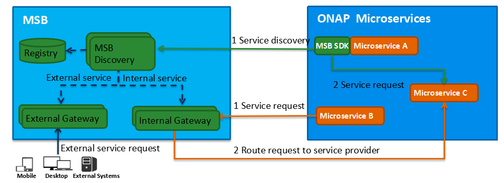

.. This work is licensed under a Creative Commons Attribution 4.0 International License.

Architecture
------------
MSB(Microservices Bus) provide a comprehensive, end to end solution to support ONAP microservice architecture including service registration/discovery, external gateway, internal gateway, client SDK. It's a pluggable architecture so it can integrate with auth service provider to provide centralized Authentication & Authorization. MSB also provides a service portal to manage the REST APIs.
MSB itself doesn’t depend on a specific environment. It can work in any bare metal, virtual machine or containerized environment.  	
MSB mainly comprises three parts: Discovery, API Gateway and MSB Client SDK. MSB also provide a swagger SDK which could generate swagger REST service description files.

Registry is the storage of service information, MSB leverage Consul as the service registry.
MSB Discovery provides REST APIs for service discovery and registration.
Service Gateway provides service request routing, load balancing and centralized Auth. It can be deployed as external Gateway or Internal Gateway.
MSB SDK is a client-side Java SDK which can be used for point to point communication of microservices.